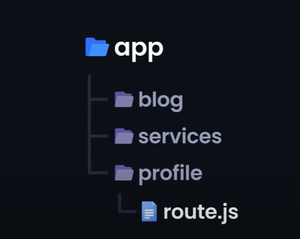
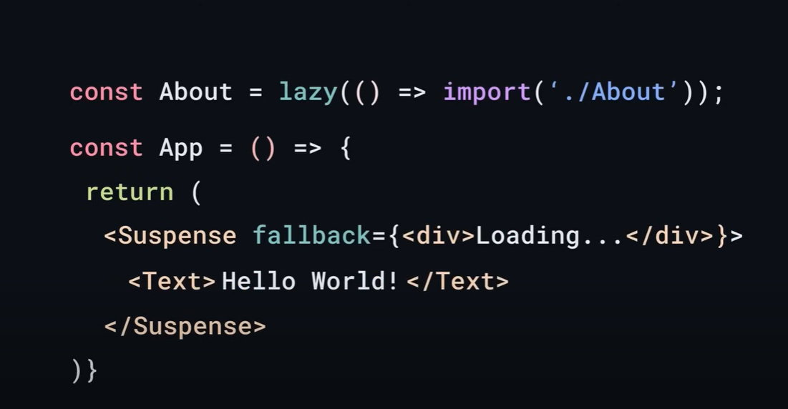

# Next.js

Built on the top of React.js

# Next.js vs React.js

---

# Next.js

# React.js

Server-side or client side render Client-side server

### File-based routing

- Each folder is a path
- Each folder name is the route path name

### API Routes

- Serverless APIs: way for creating API endpoints without the need for traditional server
- route.js Corresponds to that route API endpoint

### Automatic code splitting

1. automatically split code into chunks so that only the part that being used is that being rendered .

Ability to Server-side render in latest versions

Uses a package to handle different routes

### Automatic code splitting

1. Is applicable but through complex configurations
2. For example a component is lazy loaded when only being used or needed to be rendered and some other components is rendered to show that the required component is being rendered.

---

- Client-side render is that the server sends basic html and CSS files and the client side render them to create the component.
- Server-side render it that server renders the html and CSS after understanding the request and sends the the component pre-rendered to the client side.
- Client-side render is not SEO friendly since search engine suffer from hard indexing.
